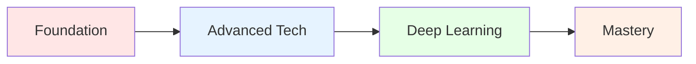

# CSC 422: Machine and Deep Learning
*Unlock the Power of AI and Transform Data into Intelligence*

---

## 👨‍🏫 Meet Your Instructor

<table>
<tr>
<td>

**🎓 Professor Robert Moseley, MS**
- 📧 **Email:** rmoseley@calbaptist.edu
- 🏢 **Office:** EGR333
- 📞 **Phone:** (951) 552–8851
- ⏰ **Office Hours:** Mon/Wed 10:30am-12:00pm, 1:00pm–3:00pm

</td>
<td width="300">

*Ready to guide you through the fascinating world of AI and machine learning!*

</td>
</tr>
</table>

---

## 📋 Prerequisites & Resources

### 📚 **Prerequisites (Required)**

Before diving into machine learning, you'll need a solid foundation in these areas:

<table>
<tr>
<td width="50%">

**🖥️ Programming Foundation**
- **EGR121** (Intro to Computer Programming in C++) **OR**
- **EGR120** (Computer Programming Languages - Python)

</td>
<td width="50%">

**🔢 Mathematical Foundation**
- **EGR130** (Mathematical Statistics I) **OR** 
- **EGR305** (Engineering Stats) **OR** 
- **MAT353** (Probability & Statistics) **OR** 
- **STA144** (Intro to Statistics) **OR** 
- Other suitable stats course

</td>
</tr>
</table>

### **Co-requisites**
None

---

## 🛠️ **Mandatory Text and Resources**

The following online resources are **required** to be purchased/accessed:

### **📚 Required Materials**

<table>
<tr>
<td width="70%">

**1. 📖 Zybook: Machine Learning and Deep Learning**
- **Platform:** Zybooks Interactive Learning
- **Access:** [learn.zybooks.com/library](https://learn.zybooks.com/library)
- **Code:** `CALBAPTISTCSC422MoseleyFall2025`

</td>
<td width="30%" align="center">

**💰 Purchase Required**

</td>
</tr>
</table>

### **💻 Development Environment (Required)**

<table>
<thead>
<tr>
<th>Tool</th>
<th>Purpose</th>
<th>Download Link</th>
</tr>
</thead>
<tbody>
<tr>
<td><strong>VS Code</strong></td>
<td>IDE for coding assignments</td>
<td><a href="https://code.visualstudio.com/">code.visualstudio.com</a></td>
</tr>
<tr>
<td><strong>Python 3.11+</strong></td>
<td>Primary programming language <em>(Enhanced library support for DL)</em></td>
<td><a href="https://www.python.org/downloads/">python.org/downloads</a></td>
</tr>
</tbody>
</table>

**Key Python Libraries We'll Use:**
- TensorFlow/PyTorch for deep learning
- NumPy, Pandas for data manipulation  
- Matplotlib, Seaborn for visualization
- Scikit-learn for traditional ML

---

## Extra Text and Resources (Optional)

Enhance your learning with these additional resources:

### **Supplementary Reading**

<strong>Understanding Deep Learning</strong>

 

**Free Online Textbook**
- **Author:** Simon J.D. Prince
- **Access:** [udlbook.github.io/udlbook](https://udlbook.github.io/udlbook/?utm_source=chatgpt.com)
- **Focus:** Comprehensive theoretical foundation
- **Best For:** Deep mathematical understanding

<strong>Machine Learning Resources</strong>

 

**Curated Learning Collection**
- **Platform:** GitHub Repository
- **Access:** [github.com/azminewasi/online-ml-university](https://github.com/azminewasi/online-ml-university?utm_source=chatgpt.com)
- **Focus:** Practical ML applications and tutorials
- **Best For:** Hands-on learning and project ideas

### **🎥 Video Resources**

<strong>3Blue1Brown Math Videos</strong>

 

**Visual Mathematics**
- **Creator:** Grant Sanderson
- **Access:** [3blue1brown.com](https://www.3blue1brown.com/)
- **Focus:** Mathematical intuition behind ML algorithms
- **Best For:** Understanding complex concepts visually

**Recommended Series:**
- Linear Algebra Essence
- Calculus Essence  
- Neural Networks Series

---

## What You'll Master

> **Transform from coding novice to AI practitioner in one semester!**

This cutting-edge course takes you on an exciting journey through:

### **Core Machine Learning**
- **Supervised Learning:** Linear & Logistic Regression, SVMs
- **Unsupervised Learning:** Clustering, PCA, Dimensionality Reduction
- **Model Validation:** Cross-validation, Bias-Variance Tradeoffs

### **Deep Learning Revolution**
- **Neural Networks:** MLPs, CNNs, RNNs
- **Advanced Architectures:** GANs, Transformers, LLMs
- **Modern Frameworks:** TensorFlow, PyTorch

### **Real-World Application**
- **Data Wrangling:** Clean and prepare real datasets
- **Research Projects:** Tackle novel AI problems
- **Ethics in AI:** Navigate the moral landscape of artificial intelligence

> **Note:** AI research moves fast! Course content evolves to include the latest breakthroughs.

---

## Learning Objectives

By course completion, you'll demonstrate mastery across these key areas:

<table>
<thead>
<tr>
<th>#</th>
<th>Learning Objective</th>
<th>Skills Developed</th>
<th>Assessment</th>
</tr>
</thead>
<tbody>
<tr>
<td>1</td>
<td><strong>Mathematical Foundations</strong> Master classification & clustering algorithms through mathematical problem-solving</td>
<td>Analysis & Problem-Solving</td>
<td>Homework</td>
</tr>
<tr>
<td>2</td>
<td><strong>Data Mastery</strong> Transform raw data into ML-ready datasets</td>
<td>Analysis, Design, Applied Knowledge</td>
<td>💻 Projects & Homework</td>
</tr>
<tr>
<td>3</td>
<td><strong>Shallow Learning</strong> Build linear models using modern ML libraries</td>
<td>Analysis, Design, Applied Knowledge</td>
<td>💻 Projects & Homework</td>
</tr>
<tr>
<td>4</td>
<td><strong>Deep Learning</strong> Construct advanced neural networks (CNNs, RNNs, GANs)</td>
<td>Analysis, Design, Applied Knowledge</td>
<td>💻 Projects & Homework</td>
</tr>
<tr>
<td>5</td>
<td><strong>Research & Innovation</strong> Explore and present cutting-edge ML topics</td>
<td>Communication & Research</td>
<td>🔬 Research Project</td>
</tr>
<tr>
<td>6</td>
<td><strong>AI Ethics</strong> Navigate moral implications of AI advancement</td>
<td>Ethics & World View</td>
<td>🔬 Research Project</td>
</tr>
</tbody>
</table>

---

## Your Learning Journey

> **Transform from curious beginner to confident AI practitioner in 14 weeks!**

### **The Path Ahead**

*Click each phase below to explore your adventure!*

---

<h2><strong>Phase 1: Foundation Building</strong></h2>
<em>Weeks 1-3: Build Your ML Foundation</em>

 

<table>
<tr>
<td width="15%" align="center">
<h3>Week 1</h3>
</td>
<td width="85%">

### **Introduction to ML & High-Level Theoretical Overview** *(CLO 5)*

**Assignment:** Coding Assignment 1 - Linear Regression Implementation

**What You'll Learn:**
- Fundamental ML concepts and terminology
- Difference between AI, ML, and Deep Learning
- Supervised vs Unsupervised learning overview
- Linear regression theory and implementation

**What You'll Create:**
- Simple linear regression from scratch in Python
- Housing price prediction model
- Reflection on ML vs traditional programming

**Skills Unlocked:** ML fundamentals, Python basics, Mathematical foundations

</td>
</tr>
<tr>
<td width="15%" align="center">
<h3>Week 2</h3>
</td>
<td width="85%">

### **ML Theory & Zybooks Study Week** *(CLO 1)*

**Focus:** Theoretical Foundation Building

**What You'll Study:**
- Zybooks Ch. 1: ML fundamentals
- Statistical concepts for ML
- Data types and preprocessing concepts
- Mathematical foundations review

**Activities:**
- Complete Zybooks readings
- Practice problems and quizzes
- Prepare for upcoming classification assignment

**Skills Unlocked:** Theoretical understanding, Statistical thinking, ML vocabulary

</td>
</tr>
<tr>
<td width="15%" align="center">
<h3>Week 3</h3>
</td>
<td width="85%">

### **Classification Models & Model Evaluation** *(CLO 1)*

**Assignment:** Coding Assignment 2 - Classification & Evaluation

**What You'll Learn:**
- Classification vs Regression models
- Logistic regression and decision trees
- Model evaluation metrics (accuracy, precision, recall)
- Supervised vs Unsupervised learning in practice

**What You'll Create:**
- Logistic regression classifier
- Decision tree implementation
- Model comparison and evaluation framework

**Skills Unlocked:** Classification algorithms, Model evaluation, Performance metrics

</td>
</tr>
</table>

<h2><strong>Phase 2: Advanced Techniques</strong></h2>
<em>Weeks 4-6: Level Up Your Skills</em>

 

<table>
<tr>
<td width="15%" align="center">
<h3>Week 4</h3>
</td>
<td width="85%">

### **Model Validation & Cross-Validation** *(CLOs 2, 3)*

**Assignment:** Coding Assignment 3 - Model Validation

**What You'll Learn:**
- Cross-validation techniques
- Bias-variance tradeoff
- Overfitting and underfitting detection
- Model selection strategies

**What You'll Create:**
- Cross-validation implementation
- Bias-variance analysis tools
- Model performance visualization

**Skills Unlocked:** Model validation, Cross-validation, Bias-variance analysis

</td>
</tr>
<tr>
<td width="15%" align="center">
<h3>Week 5</h3>
</td>
<td width="85%">

### **Unsupervised Learning & Clustering** *(CLOs 2, 3)*

**Assignment:** Coding Assignment 4 - K-means & PCA

**What You'll Learn:**
- K-means clustering algorithm
- Principal Component Analysis (PCA)
- Dimensionality reduction techniques
- Unsupervised learning applications

**What You'll Create:**
- K-means clustering implementation
- PCA for dimensionality reduction
- Cluster analysis and visualization

**Skills Unlocked:** Clustering algorithms, PCA, Dimensionality reduction

</td>
</tr>
<tr>
<td width="15%" align="center">
<h3>Week 6</h3>
</td>
<td width="85%">

### **Neural Networks & Midterm Project Launch** *(CLOs 2, 4)*

**Assignment:** Coding Assignment 5 + Midterm Project

**What You'll Learn:**
- Multi-Layer Perceptrons (MLPs)
- Neural network architecture basics
- Perceptrons, weights, and biases
- Shallow network implementation

**What You'll Create:**
- MLP from scratch using NumPy
- Neural network training algorithm
- Midterm project proposal and baseline

**Skills Unlocked:** Neural networks, Backpropagation, Project planning

</td>
</tr>
</table>

<h2><strong>Phase 3: Deep Learning Revolution</strong></h2>
<em>Weeks 7-9: Master Advanced Neural Networks</em>

 

<table>
<tr>
<td width="15%" align="center">
<h3>Week 7</h3>
</td>
<td width="85%">

### **Convolutional Neural Networks (CNNs)** *(CLO 4)*

**Assignment:** Coding Assignment 6 - Image Classification

**What You'll Learn:**
- CNN architecture and convolution operations
- Image classification techniques
- Image segmentation basics
- Computer vision fundamentals

**What You'll Create:**
- CNN for image classification
- MNIST/CIFAR-10 classifier
- Image preprocessing pipeline

**Skills Unlocked:** CNNs, Image processing, Computer vision

</td>
</tr>
<tr>
<td width="15%" align="center">
<h3>Week 8</h3>
</td>
<td width="85%">

### **Recurrent Neural Networks (RNNs)** *(CLO 4)*

**Assignment:** Coding Assignment 7 - Sequential Data

**What You'll Learn:**
- RNN and LSTM architectures
- Sequential data processing
- Temporal pattern recognition
- Time series and text analysis

**What You'll Create:**
- RNN/LSTM implementation
- Text classification model
- Time series prediction system

**Skills Unlocked:** RNNs, LSTMs, Sequential modeling

</td>
</tr>
<tr>
<td width="15%" align="center">
<h3>Week 9</h3>
</td>
<td width="85%">

### **Generative Adversarial Networks (GANs)** *(CLO 4)*

**Assignment:** Coding Assignment 8 - Generative Models

**What You'll Learn:**
- GAN architecture and training
- Generative vs discriminative models
- Diffusion models introduction
- Image generation techniques

**What You'll Create:**
- Simple GAN implementation
- Image generation system
- Model evaluation metrics

**Skills Unlocked:** GANs, Generative modeling, Adversarial training

</td>
</tr>
</table>

<h2><strong>Phase 4: Mastery & Innovation</strong></h2>
<em>Weeks 10-14: Become an AI Expert</em>

 

<table>
<tr>
<td width="15%" align="center">
<h3>Week 10</h3>
</td>
<td width="85%">

### **Transformers and LLMs** *(Theory Focus)*

**Focus:** Zybooks Ch. 10 - Advanced Topics

**What You'll Study:**
- Transformer architecture fundamentals
- Large Language Models (LLMs)
- Training stages and fine-tuning
- Attention mechanisms in detail

**Activities:**
- Complete Zybooks readings
- Transformer architecture analysis
- LLM fine-tuning exploration

**Skills Unlocked:** Transformers, LLMs, Attention mechanisms

</td>
</tr>
<tr>
<td width="15%" align="center">
<h3>Week 11</h3>
</td>
<td width="85%">

### **Reinforcement Learning** *(CLO 4)*

**Assignment:** Coding Assignment 9 - RL Fundamentals

**What You'll Learn:**
- Q-learning and policy methods
- Reinforcement learning fundamentals
- Reasoning and alignment concepts
- Agent-environment interaction

**What You'll Create:**
- Q-learning implementation
- Simple RL environment
- Policy evaluation system

**Skills Unlocked:** Q-learning, RL algorithms, Policy methods

</td>
</tr>
<tr>
<td width="15%" align="center">
<h3>Week 12</h3>
</td>
<td width="85%">

### **Extra Topics & Project Lab Time** *(CLOs 2-5)*

**Assignment:** Coding Assignment 10 - Project Progress

**What You'll Work On:**
- Advanced ML/DL topics exploration
- Individual project development
- Final project preparation
- Code refinement and testing

**What You'll Submit:**
- Project progress report
- Updated code and documentation
- Preliminary results analysis

**Skills Unlocked:** Advanced topics, Project management, Research skills

</td>
</tr>
<tr>
<tr>
<td width="15%" align="center">
<h3>Week 13</h3>
</td>
<td width="85%">

### **Final Presentations & Project Showcase** *(CLOs 2-5)*

**Focus:** Project Presentations and Course Wrap-up

**What You'll Present:**
- Complete final project presentation
- Technical implementation details
- Results analysis and conclusions
- Future work and improvements

**Activities:**
- Final project presentations
- Peer feedback and discussion
- Course reflection and review

**Skills Unlocked:** Technical presentation, Project completion, Peer evaluation

</td>
</tr>
<tr>
<td width="15%" align="center">
<h3>Week 14</h3>
</td>
<td width="85%">

### **Finals Week** *(CLOs 2-5)*

**Deliverable:** Final Project Deliverables

**What You'll Submit:**
- Complete project report and code
- Final presentation materials
- Comprehensive documentation
- Reflection on learning outcomes

**Final Requirements:**
- All code properly documented
- Results analysis and interpretation
- Professional presentation quality

**Skills Demonstrated:** Complete ML/DL project lifecycle, Technical communication

</td>
</tr>
</table>

---

### **Your Progress Tracker**

As you complete each phase, you'll unlock new capabilities:

**Foundation** → **Advanced Tech** → **Deep Learning** → **AI Mastery**

*Ready to begin your transformation into an AI practitioner?*

---

## **Tech Stack You'll Master**

| **Languages** | **Frameworks** | **Tools** | **Concepts** |
|:---:|:---:|:---:|:---:|
|  |  |  | Machine Learning |
|  |  |  | Deep Learning |
|  |  |  | Neural Networks |

---

## **Ready to Begin Your AI Journey?**

### **"The best time to plant a tree was 20 years ago. The second best time is now."**
*The same applies to learning AI and machine learning!*

**Let's build the future together, one algorithm at a time!**

---

*Course content evolves with the rapidly advancing field of AI research*

