# 🤖 CSC 422: Machine and Deep Learning
*Unlock the Power of AI and Transform Data into Intelligence*

---

## 👨‍🏫 Meet Your Instructor

<table>
<tr>
<td>

**🎓 Professor Robert Moseley, MS**
- 📧 **Email:** rmoseley@calbaptist.edu
- 🏢 **Office:** EGR333
- 📞 **Phone:** (951) 552–8851
- ⏰ **Office Hours:** Mon/Wed 10:30am-12:00pm, 1:00pm–3:00pm

</td>
<td width="300">

*Ready to guide you through the fascinating world of AI and machine learning!*

</td>
</tr>
</table>

---

## 📋 Prerequisites & Resources

### 📚 **Prerequisites (Required)**

Before diving into machine learning, you'll need a solid foundation in these areas:

<table>
<tr>
<td width="50%">

**🖥️ Programming Foundation**
- **EGR121** (Intro to Computer Programming in C++) **OR**
- **EGR120** (Computer Programming Languages - Python)

</td>
<td width="50%">

**🔢 Mathematical Foundation**
- **EGR130** (Mathematical Statistics I) **OR** 
- **EGR305** (Engineering Stats) **OR** 
- **MAT353** (Probability & Statistics) **OR** 
- **STA144** (Intro to Statistics) **OR** 
- Other suitable stats course

</td>
</tr>
</table>

### **Co-requisites**
None

---

## 🛠️ **Mandatory Text and Resources**

The following online resources are **required** to be purchased/accessed:

### **📚 Required Materials**

<table>
<tr>
<td width="70%">

**1. 📖 Zybook: Machine Learning and Deep Learning**
- **Platform:** Zybooks Interactive Learning
- **Access:** [learn.zybooks.com/library](https://learn.zybooks.com/library)
- **Code:** `CALBAPTISTCSC422MoseleyFall2025`

</td>
<td width="30%" align="center">

**💰 Purchase Required**

</td>
</tr>
</table>

### **💻 Development Environment (Required)**

<table>
<thead>
<tr>
<th>Tool</th>
<th>Purpose</th>
<th>Download Link</th>
</tr>
</thead>
<tbody>
<tr>
<td>🔧 <strong>VS Code</strong></td>
<td>IDE for coding assignments</td>
<td><a href="https://code.visualstudio.com/">code.visualstudio.com</a></td>
</tr>
<tr>
<td>🐍 <strong>Python 3.11+</strong></td>
<td>Primary programming language <em>(Enhanced library support for DL)</em></td>
<td><a href="https://www.python.org/downloads/">python.org/downloads</a></td>
</tr>
</tbody>
</table>

**Key Python Libraries We'll Use:**
- TensorFlow/PyTorch for deep learning
- NumPy, Pandas for data manipulation  
- Matplotlib, Seaborn for visualization
- Scikit-learn for traditional ML

---

## 📖 **Extra Text and Resources (Optional)**

Enhance your learning with these additional resources:

### **📚 Supplementary Reading**

<strong>🧠 Understanding Deep Learning</strong>

 

**📖 Free Online Textbook**
- **Author:** Simon J.D. Prince
- **Access:** [udlbook.github.io/udlbook](https://udlbook.github.io/udlbook/?utm_source=chatgpt.com)
- **Focus:** Comprehensive theoretical foundation
- **Best For:** Deep mathematical understanding

<strong>📠Machine Learning Resources</strong>

 

**📚 Curated Learning Collection**
- **Platform:** GitHub Repository
- **Access:** [github.com/azminewasi/online-ml-university](https://github.com/azminewasi/online-ml-university?utm_source=chatgpt.com)
- **Focus:** Practical ML applications and tutorials
- **Best For:** Hands-on learning and project ideas

### **🎥 Video Resources**

<strong>🯠3Blue1Brown Math Videos</strong>

 

**📺 Visual Mathematics**
- **Creator:** Grant Sanderson
- **Access:** [3blue1brown.com](https://www.3blue1brown.com/)
- **Focus:** Mathematical intuition behind ML algorithms
- **Best For:** Understanding complex concepts visually

**Recommended Series:**
- Linear Algebra Essence
- Calculus Essence  
- Neural Networks Series

---

## 🎯 What You'll Master

> **Transform from coding novice to AI practitioner in one semester!**

This cutting-edge course takes you on an exciting journey through:

### 🧠 **Core Machine Learning**
- **Supervised Learning:** Linear & Logistic Regression, SVMs
- **Unsupervised Learning:** Clustering, PCA, Dimensionality Reduction
- **Model Validation:** Cross-validation, Bias-Variance Tradeoffs

### 🚀 **Deep Learning Revolution**
- **Neural Networks:** MLPs, CNNs, RNNs
- **Advanced Architectures:** GANs, Transformers, LLMs
- **Modern Frameworks:** TensorFlow, PyTorch

### 🔬 **Real-World Application**
- **Data Wrangling:** Clean and prepare real datasets
- **Research Projects:** Tackle novel AI problems
- **Ethics in AI:** Navigate the moral landscape of artificial intelligence

> ⚡ **Note:** AI research moves fast! Course content evolves to include the latest breakthroughs.

---

## 🎯 Learning Objectives

By course completion, you'll demonstrate mastery across these key areas:

<table>
<thead>
<tr>
<th>🎯</th>
<th>Learning Objective</th>
<th>Skills Developed</th>
<th>Assessment</th>
</tr>
</thead>
<tbody>
<tr>
<td>1️⃣</td>
<td><strong>Mathematical Foundations</strong> Master classification & clustering algorithms through mathematical problem-solving</td>
<td>Analysis & Problem-Solving</td>
<td>📝 Homework</td>
</tr>
<tr>
<td>2️⃣</td>
<td><strong>Data Mastery</strong> Transform raw data into ML-ready datasets</td>
<td>Analysis, Design, Applied Knowledge</td>
<td>💻 Projects & Homework</td>
</tr>
<tr>
<td>3️⃣</td>
<td><strong>Shallow Learning</strong> Build linear models using modern ML libraries</td>
<td>Analysis, Design, Applied Knowledge</td>
<td>💻 Projects & Homework</td>
</tr>
<tr>
<td>4️⃣</td>
<td><strong>Deep Learning</strong> Construct advanced neural networks (CNNs, RNNs, GANs)</td>
<td>Analysis, Design, Applied Knowledge</td>
<td>💻 Projects & Homework</td>
</tr>
<tr>
<td>5️⃣</td>
<td><strong>Research & Innovation</strong> Explore and present cutting-edge ML topics</td>
<td>Communication & Research</td>
<td>🔬 Research Project</td>
</tr>
<tr>
<td>6️⃣</td>
<td><strong>AI Ethics</strong> Navigate moral implications of AI advancement</td>
<td>Ethics & World View</td>
<td>🔬 Research Project</td>
</tr>
</tbody>
</table>

---

## 📅 Your Learning Journey

> **Transform from curious beginner to confident AI practitioner in 14 weeks!**

### 🛤️ **The Path Ahead**

```mermaid
graph LR
    A[🚀 Foundation] --> B[🔬 Advanced Tech] --> C[🧠 Deep Learning] --> D[🎓 Mastery]
    
    style A fill:#FFE6E6
    style B fill:#E6F3FF
    style C fill:#E6FFE6
    style D fill:#FFF0E6
```

*Click each phase below to explore your adventure!*

---

## 🌟 **Phase 1: Foundation Building**
*Weeks 1-3: Build Your ML Foundation*

<table>
<tr>
<td width="15%" align="center">
<h3>🏠</h3>
<strong>Week 1</strong>
</td>
<td width="85%">

### **Housing Price Prediction** *(CLO 5)*

**🎯 Your Mission:** Build your very first machine learning model!

**What You'll Create:**
- Linear regression model from scratch (no libraries!)
- Real housing price predictor using Python
- Comparison between your code and professional ML libraries

**Skills Unlocked:** 🐍 Python fundamentals, 📊 Regression basics, 🧮 Mathematical thinking

**Victory Condition:** Successfully predict house prices and understand how ML differs from traditional programming

</td>
</tr>
<tr>
<td width="15%" align="center">
<h3>🎯</h3>
<strong>Week 3</strong>
</td>
<td width="85%">

### **Classification Showdown** *(CLO 1)*

**🎯 Your Mission:** Master the art of classification!

**What You'll Create:**
- Logistic regression vs Decision tree battle
- Model accuracy comparison dashboard
- Real-world labeled dataset analysis

**Skills Unlocked:** 🔍 Classification techniques, 📈 Model evaluation, 📊 Data interpretation

**Victory Condition:** Train competing models and determine which performs better on your dataset

</td>
</tr>
</table>

---

## 🔬 **Phase 2: Advanced Techniques**
*Weeks 4-6: Level Up Your Skills*

<table>
<tr>
<td width="15%" align="center">
<h3>⚖️</h3>
<strong>Week 4</strong>
</td>
<td width="85%">

### **Bias-Variance Battle** *(CLOs 2, 3)*

**🎯 Your Mission:** Conquer overfitting and underfitting!

**What You'll Create:**
- Cross-validation testing framework
- Interactive bias-variance visualization
- Model optimization strategies

**Skills Unlocked:** 🎨 Advanced visualization, 🔧 Model tuning, 📊 Performance analysis

**Victory Condition:** Create models that generalize well to unseen data

</td>
</tr>
<tr>
<td width="15%" align="center">
<h3>🔍</h3>
<strong>Week 5</strong>
</td>
<td width="85%">

### **Unsupervised Discovery** *(CLOs 2, 3)*

**🎯 Your Mission:** Find hidden patterns in unlabeled data!

**What You'll Create:**
- K-means clustering algorithm
- PCA dimensionality reduction
- Cluster quality assessment tools

**Skills Unlocked:** 🕵️ Pattern recognition, 📐 Dimensionality reduction, 🎯 Cluster analysis

**Victory Condition:** Discover meaningful groups in data without any labels

</td>
</tr>
<tr>
<td width="15%" align="center">
<h3>🧠⭐</h3>
<strong>Week 6</strong>
</td>
<td width="85%">

### **Neural Network Genesis + Midterm Launch** *(CLOs 2, 4)*

**🎯 Your Mission:** Enter the world of neural networks!

**What You'll Create:**
- Multi-layer perceptron from scratch (NumPy only!)
- Midterm project proposal and initial implementation
- Neural network visualization tools

**Skills Unlocked:** 🧠 Neural network fundamentals, 🚀 Project management, 🔬 Research skills

**Victory Condition:** Build working neural networks and launch your midterm research project

</td>
</tr>
</table>

---

## 🚀 **Phase 3: Deep Learning Revolution**
*Weeks 7-9: Master Advanced Neural Networks*

<table>
<tr>
<td width="15%" align="center">
<h3>👁️</h3>
<strong>Week 7</strong>
</td>
<td width="85%">

### **Computer Vision Mastery** *(CLO 4)*

**🎯 Your Mission:** Teach computers to see!

**What You'll Create:**
- Convolutional Neural Networks (CNNs)
- Image classifier for MNIST/CIFAR-10
- Filter visualization dashboard

**Skills Unlocked:** 🖼️ Computer vision, 🔧 TensorFlow/PyTorch, 🎨 Feature visualization

**Victory Condition:** Build CNNs that can recognize handwritten digits and everyday objects

</td>
</tr>
<tr>
<td width="15%" align="center">
<h3>📝</h3>
<strong>Week 8</strong>
</td>
<td width="85%">

### **Sequential Data Magic** *(CLO 4)*

**🎯 Your Mission:** Master time and language!

**What You'll Create:**
- Recurrent Neural Networks (RNNs/LSTMs)
- Text and time series prediction models
- Hidden state analysis tools

**Skills Unlocked:** ⏰ Sequence modeling, 💬 Natural language processing, 📈 Time series analysis

**Victory Condition:** Create models that understand temporal patterns and generate text

</td>
</tr>
<tr>
<td width="15%" align="center">
<h3>🎨</h3>
<strong>Week 9</strong>
</td>
<td width="85%">

### **Creative AI with GANs** *(CLO 4)*

**🎯 Your Mission:** Generate entirely new data!

**What You'll Create:**
- Generative Adversarial Network (GAN)
- Image generation system
- Quality evaluation metrics (FID)

**Skills Unlocked:** 🎭 Generative modeling, ⚡ Adversarial training, 🎪 Creative AI

**Victory Condition:** Train networks that can create realistic new images from random noise

</td>
</tr>
</table>

---

## 🎓 **Phase 4: Mastery & Innovation**
*Weeks 10-14: Become an AI Expert*

<table>
<tr>
<td width="15%" align="center">
<h3>🤖</h3>
<strong>Week 10</strong>
</td>
<td width="85%">

### **Transformer Deep Dive** *(Theory Focus)*

**🎯 Your Mission:** Understand the architecture powering ChatGPT!

**What You'll Study:**
- Transformer architecture fundamentals
- Attention mechanisms and self-attention
- Fine-tuning strategies for large language models

**Skills Unlocked:** 🧠 Advanced architectures, 💡 Attention theory, 🔬 Cutting-edge research

**Victory Condition:** Deeply understand the technology behind modern AI breakthroughs

</td>
</tr>
<tr>
<td width="15%" align="center">
<h3>🎮</h3>
<strong>Week 11</strong>
</td>
<td width="85%">

### **Reinforcement Learning** *(CLO 4)*

**🎯 Your Mission:** Create AI that learns through trial and error!

**What You'll Create:**
- Q-learning agent for Gridworld
- Reward shaping experiments
- Policy evaluation systems

**Skills Unlocked:** 🎯 Decision making, 🎮 Game AI, 🏆 Reward optimization

**Victory Condition:** Train agents that can navigate environments and maximize rewards

</td>
</tr>
<tr>
<td width="15%" align="center">
<h3>🔬</h3>
<strong>Week 12</strong>
</td>
<td width="85%">

### **Project Progress Showcase** *(CLOs 2–5)*

**🎯 Your Mission:** Demonstrate your research progress!

**What You'll Submit:**
- Comprehensive project notebook
- Dataset preparation documentation
- Baseline model results and analysis

**Skills Unlocked:** 📊 Project documentation, 📈 Progress tracking, 🎯 Milestone management

**Victory Condition:** Clear demonstration of project progress with solid baseline results

</td>
</tr>
<tr>
<td width="15%" align="center">
<h3>🏆</h3>
<strong>Week 14</strong>
</td>
<td width="85%">

### **Final Project Presentation** *(CLOs 2–5)*

**🎯 Your Mission:** Showcase your AI mastery!

**What You'll Deliver:**
- Complete deep learning research project
- Professional presentation to the class
- Comprehensive technical report

**Skills Unlocked:** 🎤 Technical presentation, 📝 Research writing, 🌟 AI innovation

**Victory Condition:** Successfully apply advanced ML/DL techniques to solve a novel problem

</td>
</tr>
</table>

---

### 🎯 **Your Progress Tracker**

As you complete each phase, you'll unlock new capabilities:

**🚀 Foundation** → **🔬 Advanced Tech** → **🧠 Deep Learning** → **🎓 AI Mastery**

*Ready to begin your transformation into an AI practitioner?*

---

## 🛠️ **Tech Stack You'll Master**

| **Languages** | **Frameworks** | **Tools** | **Concepts** |
|:---:|:---:|:---:|:---:|
|  |  |  | Machine Learning |
|  |  |  | Deep Learning |
|  |  |  | Neural Networks |

---

## 🌟 **Ready to Begin Your AI Journey?**

### 💡 **"The best time to plant a tree was 20 years ago. The second best time is now."**
*The same applies to learning AI and machine learning!*

**🚀 Let's build the future together, one algorithm at a time! 🚀**

---

*Course content evolves with the rapidly advancing field of AI research*

